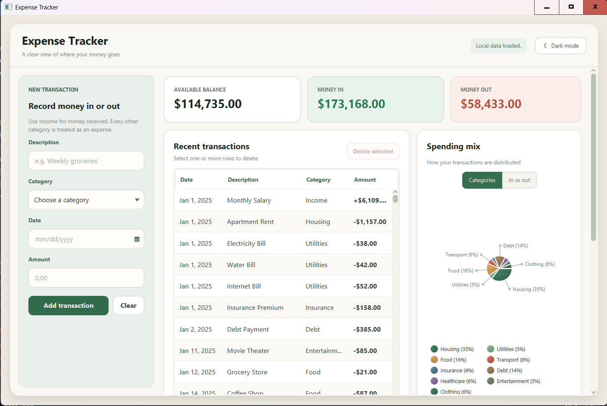
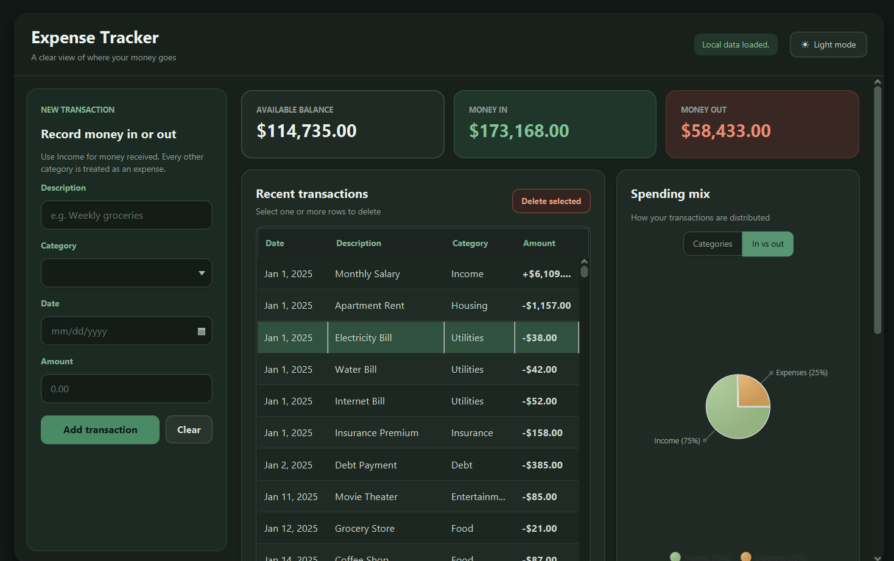
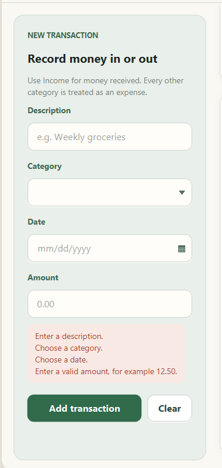
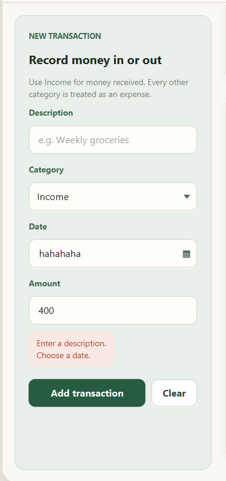
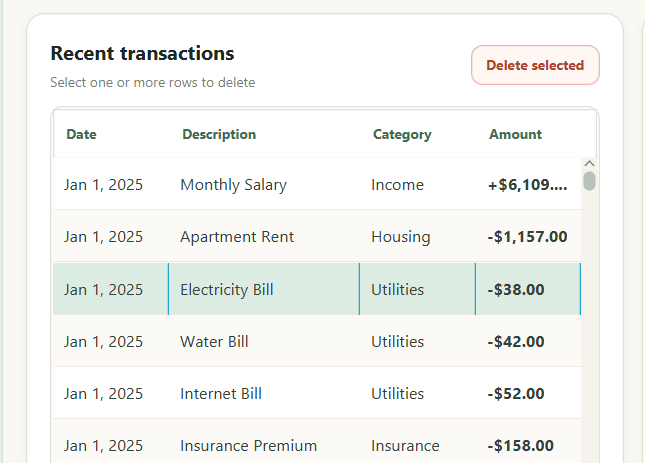
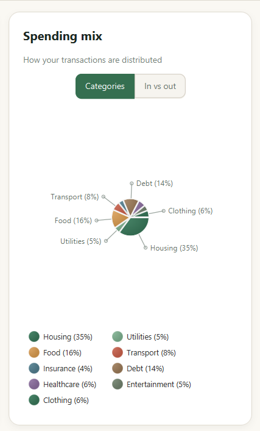
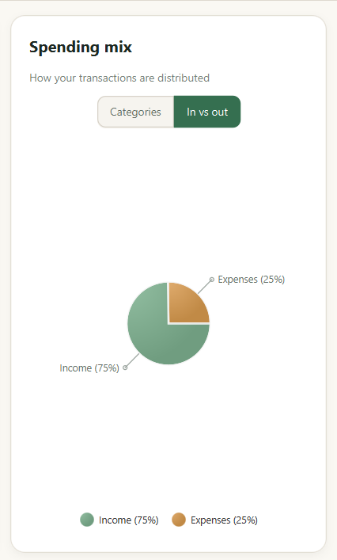
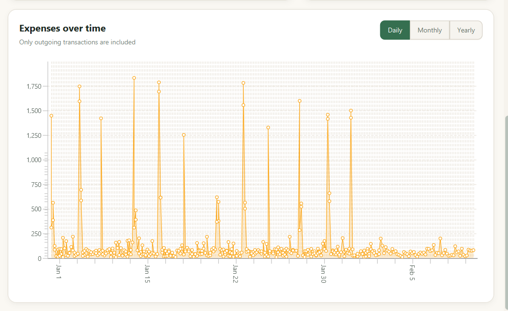
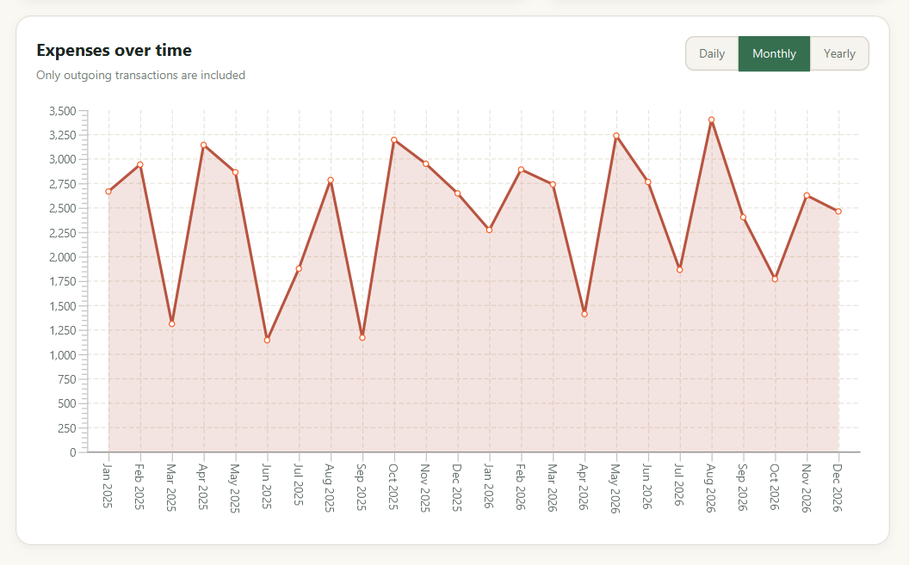

# Expense Tracker

A desktop app for tracking your income and expenses, built with **Java** and **JavaFX**. Add transactions, see your balance at a glance, and explore where your money goes with charts, in a clean light or dark theme.



## Features

- **Add income and expenses** with a description, category, date and amount (decimals like `12.50` are supported)
- **Clear validation messages** that tell you exactly what to fix in the form
- **Summary cards** showing available balance, money in and money out
- **Transactions table** with multi-row selection and delete (with confirmation)
- **Spending mix chart** that switches between *Categories* and *In vs out*
- **Expenses over time** chart with *Daily*, *Monthly* and *Yearly* views
- **Light and dark mode**, switchable from the header
- **Local storage**: your data is saved in a JSON file and reloaded at startup

## Screenshots

### Dark mode



### Add a transaction

The form checks your input and explains what is missing or invalid.

<p align="center">
  

</p>

### Transactions

Select one or more rows and delete them. Income is shown in `+`, expenses in `-`.



### Spending mix

<p align="center">
  
  &nbsp;&nbsp;
  
</p>

### Expenses over time

Daily values are grouped by real dates, and you can switch to monthly or yearly totals.





## Tech stack

- Java
- JavaFX (FXML + CSS)
- Maven
- Jackson (JSON storage)

## Getting started

### Requirements

- A recent JDK (check the `pom.xml` for the exact version this project targets)
- Git

Maven is not required to be installed: the project includes the Maven Wrapper.

### Run the app

```bash
git clone https://github.com/axiomdevv/Expense-tracker.git
cd Expense-tracker
```

On Windows:

```bash
mvnw.cmd javafx:run
```

On macOS / Linux:

```bash
./mvnw javafx:run
```

## Project structure

```text
src/main/java/com/axiomdevv/expensetracker/
├── Launcher.java
├── TrackerApplication.java      # starts the app
├── model/                       # Expense, Category, ExpenseSummary, ExpenseDraft
├── data/
│   └── ExpenseRepository.java   # loads and saves the JSON file
├── service/
│   ├── ExpenseAnalytics.java    # totals and chart calculations
│   └── ExpenseValidator.java    # form validation
└── ui/
    ├── TrackerController.java   # coordinates the screen
    ├── ExpenseFormController.java
    ├── SummaryCardsController.java
    ├── ExpenseTableController.java
    ├── CategoryChartController.java
    ├── TimelineChartController.java
    └── ThemeManager.java        # light / dark switching

src/main/resources/com/axiomdevv/expensetracker/
├── views/                       # main FXML + components/
└── styles/                      # base.css, light-theme.css, dark-theme.css
```

### How it works

1. `TrackerController` receives actions from the form and the table.
2. `ExpenseValidator` checks the input.
3. `ExpenseRepository` saves the updated list to the JSON file.
4. `ExpenseAnalytics` calculates the totals and chart data.
5. The UI controllers redraw the summary, table and charts.

## Author

Made by [axiomdevv](https://github.com/axiomdevv).